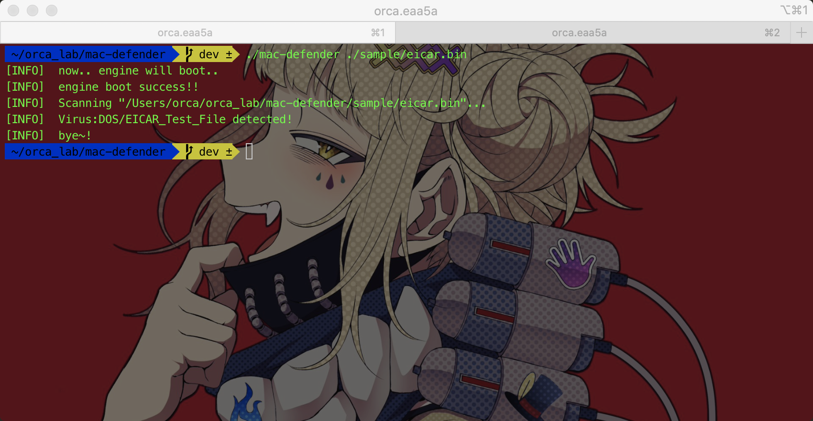

# MacDefender
Port Windows Defender to OSX


## Feature
1. Remove all __dependency of Windows__ by porting WIN API
2. Support __64bit OS__
3. Support Windows SEH(x64) in OSX
4. Only for __Intel__ (M1 is not supported)

## Installation and Setup

1. Clone
```bash
git clone https://github.com/orca-eaa5a/mac-defender.git
```
2. Set Pre-Defined Macros
- \_\_APPLE\_\_ , \_X64
- \_\_LOG\_\_ ([optional] logging ported WIN API Call)
3. Build use __GCC__ (not clang)

## Usage

```bash
./mac-defender $target_file
```

## Reference
1. https://github.com/taviso/loadlibrary
2. https://github.com/reactos/reactos
3. https://github.com/wine-mirror/wine
4. https://github.com/mandiant/speakeasy
5. https://github.com/orca-eaa5a/winx86emulator


## License
[GNU](https://choosealicense.com/licenses/mit/)
